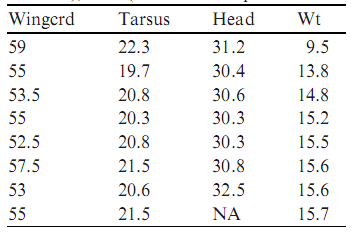
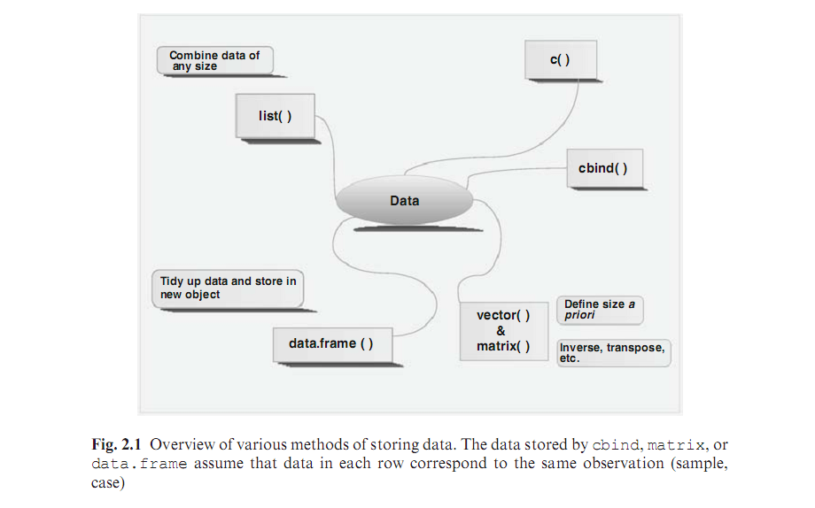

## Entering Data

 1. Entering data by hand
 2. Entering data with ```c()```
 3. Combining variables: ```c()```, ```cbind()```, ```rbind()```
 4. Functions ```vector()```, ```matrix()```, ```list()```, ```data.frame()```
 5. But better to enter it outside of R


--- &twocol w1:50% w2:50%
## Entering data by hand

*** left
<figure></figure>


*** right
<figure></figure>


---
## Types of data
<figure></figure>


---
## Importing Data

 MUCH easier to import data from other programmes than enter them again by hand into R

 Importing data is the most difficult thing in R (at least in the beginning...).

# How to import data:
 1. enter the data in a spreadsheet (Excel, Gnumeric, OpenOffice Calc)
 2. export the data as tab-delimited text file
 3. close the spreadsheet
 4. ```setwd()``` to working directory

```
setwd("C:\\R_Quito\\data\\") # or
setwd("C:/R_Quito/data/")
```

---
## Importing Data

5. import the data into R with ```read.table()```, ```read.cvs()``` or similar:
     - other functions can import data directly from Excel etc. NOT RECOMMENDED.

```
dat.sparrows <- read.table(file = "sparrow.txt", header = TRUE)
```

---
## Importing data: details

 * Enter data in spreadsheet (e.g. gnumeric, OpenOffice Calc, Excel).
 * 'NA' for missing data
 * First row = names of variables
 * First column = unit of sampling
 * Names without spaces, #, etc.
 * No # or ' in the file (comment sign in R)
 * copy and paste into text editor
 * Save as foo.txt file
 * Copy and paste the file address
 * [WIN] Change the \ to: \\ or / 
 * [WIN] Include /My Documents/ as is 

---
## , or .  ?

 * Excel uses . or , to separate decimals, depending on location
 * If the file was made in a computer with , 
     You must include the argument: ```dec= “,”``` in ```read.table()```

```
dat.sparrows <- read.table(file = “sparrows.txt”, header = TRUE)
dat.sparrows <- read.table(file = “sparrows.txt”, header = TRUE, dec = “,”)
dat.sparrows <-   read.csv(file = “sparrows.csv”, header = TRUE)
```

 * Very important to check that the data imported correctly!

```
str(dat.sparrows)
```

---
## Obtaining data remotely


### ```read.table()```

```
dat <- read.table(file = "http://www.simonqueenborough.com/R/data/sparrows.txt")
```

### HTML tables in webpages
```
library(XML)
dat <- readHTMLTable()
``` 

### ```url()```

```
dat <- url()
```


---
## Exercises

[exercises-02.R](http://www.simonqueenborough.com/R/code/exercises-02.R)


